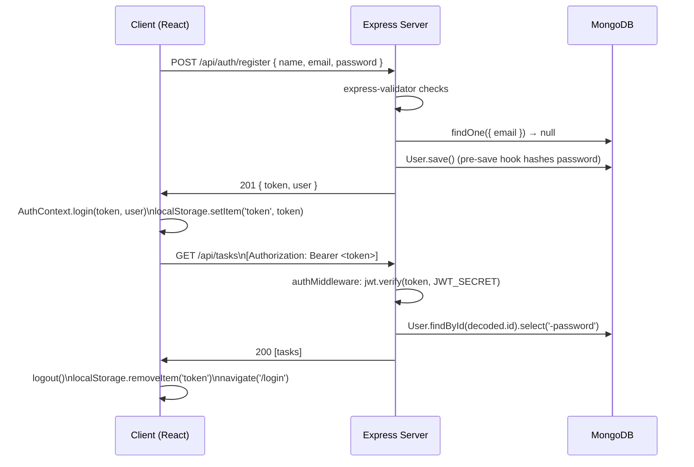

# Design Document

## Overview

The Task Management Application is a full-stack web app built on the MERN stack (MongoDB, Express, React, Node.js). Users register, log in, and privately manage tasks with rich metadata (priority, status, category, due date). A React SPA communicates with a REST API over HTTPS; JWTs carry authentication state. The backend exposes two logical service areas: Auth_Service (registration, login, profile) and Task_Service (task CRUD, search, filter, sort, dashboard aggregation).

### Technology Choices

| Layer | Technology | Rationale |
|-------|-----------|-----------|
| Frontend | React 18 + Vite | Fast HMR, modern JSX, broad ecosystem |
| Styling | Tailwind CSS | Utility-first, responsive breakpoints, minimal bundle |
| State / Auth | React Context + useReducer | Lightweight; JWT stored in `localStorage` |
| Routing | React Router v6 | Declarative protected routes |
| HTTP client | Axios | Interceptors for attaching JWT header |
| Backend | Node.js + Express | Minimal, well-known REST framework |
| Validation | express-validator | Declarative middleware-level schema validation |
| Database | MongoDB + Mongoose | Flexible document model, schema validation, ODM |
| Auth | JWT (jsonwebtoken) + bcrypt | Stateless auth, secure password hashing |
| Config | dotenv | Environment variable management |

---

## Architecture

```mermaid
graph TD
  subgraph Browser
    A[React SPA\nReact Router v6]
    A --> B[AuthContext\nuseReducer]
    A --> C[Axios Instance\nAuthorization header]
  end

  subgraph Node/Express Server
    D[Express App]
    D --> E[/api/auth routes]
    D --> F[/api/tasks routes]
    D --> G[/api/dashboard route]
    E --> H[Auth Controller]
    F --> I[Task Controller]
    G --> J[Dashboard Controller]
    H --> K[authMiddleware]
    I --> K
    J --> K
  end

  subgraph MongoDB
    L[(users collection)]
    M[(tasks collection)]
  end

  C -->|HTTP/JSON| D
  H --> L
  I --> M
  J --> M
```

### Request Lifecycle

1. React component calls an Axios helper function.
2. Axios request interceptor attaches `Authorization: Bearer <token>`.
3. Express routes pass the request through `authMiddleware` (JWT verification).
4. Controller runs express-validator checks, then delegates to Mongoose.
5. Mongoose validates schema constraints; returns document or throws.
6. Controller serialises the response and sends JSON back to the client.

---

## Components and Interfaces

### Frontend Component Tree

```
App
├── AuthContext (Provider)
├── Router
│   ├── PublicRoute wrapper
│   │   ├── /login  → LoginPage
│   │   └── /register → RegisterPage
│   └── ProtectedRoute wrapper
│       ├── /dashboard → DashboardPage
│       ├── /tasks     → TaskListPage
│       │   └── TaskCard
│       │       └── TaskActions (edit / delete buttons)
│       ├── /tasks/new → TaskFormPage
│       └── /tasks/:id/edit → TaskFormPage
└── Shared
    ├── Navbar
    ├── Spinner
    ├── AlertBanner
    └── ConfirmModal
```

#### Key Frontend Modules

| Module | Responsibility |
|--------|---------------|
| `AuthContext` | Holds `{ user, token }`, exposes `login()`, `logout()`, `register()` actions |
| `api.js` (Axios instance) | Base URL, JWT interceptor, global error handler |
| `authService.js` | Wraps `/api/auth/*` endpoints |
| `taskService.js` | Wraps `/api/tasks/*` and `/api/dashboard` endpoints |
| `ProtectedRoute` | Redirects to `/login` when `token` is absent |
| `PublicRoute` | Redirects to `/dashboard` when `token` is present |
| `TaskListPage` | Search input, filter dropdowns, sort select, task grid |
| `TaskFormPage` | Controlled form; used for both create and edit |
| `DashboardPage` | Stat cards + "due today" count |

### Backend Module Structure

```
server/
├── config/
│   └── db.js              # Mongoose connect
├── middleware/
│   └── authMiddleware.js  # JWT verify → req.user
├── models/
│   ├── User.js
│   └── Task.js
├── controllers/
│   ├── authController.js
│   ├── taskController.js
│   └── dashboardController.js
├── routes/
│   ├── authRoutes.js
│   ├── taskRoutes.js
│   └── dashboardRoutes.js
├── validators/
│   ├── authValidators.js
│   └── taskValidators.js
└── server.js
```

---

## Data Models

### User Schema (Mongoose)

```js
const userSchema = new mongoose.Schema(
  {
    name:     { type: String, required: true, trim: true },
    email:    { type: String, required: true, unique: true, lowercase: true, trim: true },
    password: { type: String, required: true }, // bcrypt hash, never returned
  },
  { timestamps: true }  // adds createdAt, updatedAt
);

// Pre-save hook: hash password if modified
userSchema.pre('save', async function (next) {
  if (!this.isModified('password')) return next();
  this.password = await bcrypt.hash(this.password, 12);
  next();
});

// Instance method: compare password
userSchema.methods.matchPassword = async function (plain) {
  return bcrypt.compare(plain, this.password);
};

// Override toJSON to strip password
userSchema.set('toJSON', {
  transform: (_, ret) => { delete ret.password; return ret; }
});
```

#### User Fields

| Field | Type | Constraints |
|-------|------|-------------|
| `name` | String | required, trimmed |
| `email` | String | required, unique, lowercase |
| `password` | String | required, stored as bcrypt hash |
| `createdAt` | Date | auto (timestamps) |
| `updatedAt` | Date | auto (timestamps) |

---

### Task Schema (Mongoose)

```js
const PRIORITIES = ['High', 'Medium', 'Low'];
const STATUSES   = ['Pending', 'In Progress', 'Completed'];

const taskSchema = new mongoose.Schema(
  {
    user:        { type: mongoose.Schema.Types.ObjectId, ref: 'User', required: true, index: true },
    title:       { type: String, required: true, trim: true },
    description: { type: String, default: '' },
    status:      { type: String, enum: STATUSES,   default: 'Pending' },
    priority:    { type: String, enum: PRIORITIES, default: 'Medium' },
    category:    { type: String, default: '' },
    dueDate:     { type: Date,   default: null },
  },
  { timestamps: true }
);

// Compound index for fast per-user queries
taskSchema.index({ user: 1, createdAt: -1 });
taskSchema.index({ user: 1, dueDate:   1 });
```

#### Task Fields

| Field | Type | Constraints | Default |
|-------|------|-------------|---------|
| `user` | ObjectId | required, ref User | — |
| `title` | String | required, trimmed | — |
| `description` | String | optional | `''` |
| `status` | String | enum: Pending / In Progress / Completed | `'Pending'` |
| `priority` | String | enum: High / Medium / Low | `'Medium'` |
| `category` | String | optional | `''` |
| `dueDate` | Date | optional, ISO 8601 | `null` |
| `createdAt` | Date | auto | — |
| `updatedAt` | Date | auto | — |

---

## API Design

All endpoints are prefixed `/api`. Authenticated endpoints require `Authorization: Bearer <token>`.

### Auth Endpoints

#### POST /api/auth/register

Request body:
```json
{ "name": "Alice", "email": "alice@example.com", "password": "secret123" }
```

Success `201`:
```json
{ "token": "<jwt>", "user": { "_id": "…", "name": "Alice", "email": "alice@example.com", "createdAt": "…" } }
```

Errors: `400` (validation), `409` (duplicate email)

---

#### POST /api/auth/login

Request body:
```json
{ "email": "alice@example.com", "password": "secret123" }
```

Success `200`:
```json
{ "token": "<jwt>", "user": { "_id": "…", "name": "Alice", "email": "alice@example.com" } }
```

Errors: `400` (validation), `401` (bad credentials)

---

#### GET /api/auth/profile *(protected)*

Success `200`:
```json
{ "_id": "…", "name": "Alice", "email": "alice@example.com", "createdAt": "…" }
```

Errors: `401` (missing/invalid JWT)

---

### Task Endpoints *(all protected)*

#### POST /api/tasks

Request body:
```json
{
  "title": "Buy groceries",
  "description": "Milk, eggs, bread",
  "status": "Pending",
  "priority": "Low",
  "category": "Personal",
  "dueDate": "2025-08-01"
}
```

Success `201`:
```json
{ "_id": "…", "user": "…", "title": "Buy groceries", "status": "Pending", "priority": "Low", "category": "Personal", "dueDate": "2025-08-01T00:00:00.000Z", "createdAt": "…", "updatedAt": "…" }
```

Errors: `400` (missing title, invalid dueDate, invalid enum)

---

#### GET /api/tasks

Query parameters (all optional):

| Param | Type | Description |
|-------|------|-------------|
| `search` | string | Case-insensitive title match |
| `status` | string | Filter by status value |
| `priority` | string | Filter by priority value |
| `category` | string | Filter by category value |
| `dueDate` | string | Filter by exact calendar date (YYYY-MM-DD) |
| `sort` | string | `latest` \| `oldest` \| `dueDate` \| `priority` |

Success `200`:
```json
[{ "_id": "…", "title": "…", "status": "…", "priority": "…", … }]
```

---

#### GET /api/tasks/:id

Success `200`: single task object

Errors: `404` (not found or not owned by user)

---

#### PUT /api/tasks/:id

Request body: any subset of task fields (partial update)

Success `200`: updated task object

Errors: `400` (invalid enum), `404` (not found/not owned)

---

#### DELETE /api/tasks/:id

Success `200`:
```json
{ "message": "Task deleted successfully" }
```

Errors: `404` (not found/not owned)

---

### Dashboard Endpoint *(protected)*

#### GET /api/dashboard

Success `200`:
```json
{
  "total": 12,
  "completed": 4,
  "pending": 5,
  "inProgress": 3,
  "dueToday": 2
}
```

Implementation uses a single MongoDB aggregation pipeline:
```js
Task.aggregate([
  { $match: { user: userId } },
  {
    $group: {
      _id: null,
      total:      { $sum: 1 },
      completed:  { $sum: { $cond: [{ $eq: ['$status', 'Completed'] }, 1, 0] } },
      pending:    { $sum: { $cond: [{ $eq: ['$status', 'Pending'] }, 1, 0] } },
      inProgress: { $sum: { $cond: [{ $eq: ['$status', 'In Progress'] }, 1, 0] } },
      dueToday: {
        $sum: {
          $cond: [
            { $and: [
              { $gte: ['$dueDate', startOfDay] },
              { $lt:  ['$dueDate', endOfDay] }
            ]},
            1, 0
          ]
        }
      }
    }
  }
])
```

---

## Authentication Flow



### JWT Structure

```json
{
  "id": "<userId>",
  "iat": 1700000000,
  "exp": 1700086400
}
```

- Signed with `HS256` using `process.env.JWT_SECRET`
- Expiry: `24h`
- `authMiddleware` rejects expired or tampered tokens with `401`

---

## Frontend Routing and State Management

### React Router v6 Routes

```jsx
<Routes>
  <Route element={<PublicRoute />}>
    <Route path="/login"    element={<LoginPage />} />
    <Route path="/register" element={<RegisterPage />} />
  </Route>
  <Route element={<ProtectedRoute />}>
    <Route path="/dashboard"      element={<DashboardPage />} />
    <Route path="/tasks"          element={<TaskListPage />} />
    <Route path="/tasks/new"      element={<TaskFormPage />} />
    <Route path="/tasks/:id/edit" element={<TaskFormPage />} />
  </Route>
  <Route path="*" element={<Navigate to="/dashboard" />} />
</Routes>
```

### AuthContext Shape

```js
const initialState = { user: null, token: null };

function authReducer(state, action) {
  switch (action.type) {
    case 'LOGIN':  return { user: action.payload.user, token: action.payload.token };
    case 'LOGOUT': return initialState;
    default:       return state;
  }
}
```

On app boot, `AuthContext` reads `localStorage.getItem('token')` and decodes it to restore session without a network round-trip.

---

## Search, Filter, and Sort Query Handling

The Task Controller builds a Mongoose query object dynamically:

```js
// taskController.js – getTasks
const query = { user: req.user._id };

if (search)   query.title    = { $regex: search, $options: 'i' };
if (status)   query.status   = status;
if (priority) query.priority = priority;
if (category) query.category = category;
if (dueDate) {
  const start = new Date(dueDate); start.setHours(0, 0, 0, 0);
  const end   = new Date(dueDate); end.setHours(23, 59, 59, 999);
  query.dueDate = { $gte: start, $lte: end };
}

const SORT_MAP = {
  latest:   { createdAt: -1 },
  oldest:   { createdAt:  1 },
  dueDate:  { dueDate:    1 },
  priority: { priority:   1 }, // handled below
};

// Priority sort: custom numeric mapping via aggregate or sort post-query
const priorityOrder = { High: 0, Medium: 1, Low: 2 };
let tasks = await Task.find(query).sort(sort === 'priority' ? {} : SORT_MAP[sort] || { createdAt: -1 });
if (sort === 'priority') {
  tasks.sort((a, b) => priorityOrder[a.priority] - priorityOrder[b.priority]);
}
```

---

## Responsive Design

Tailwind CSS breakpoint strategy:

| Breakpoint | Width | Layout |
|-----------|-------|--------|
| default (mobile) | < 640px | Single-column stack, hamburger nav |
| `sm` | ≥ 640px | Two-column task grid |
| `md` | ≥ 768px | Sidebar nav, three-column task grid |
| `lg` | ≥ 1024px | Full dashboard with stat cards in a row |

Key Tailwind patterns used:
- `grid grid-cols-1 sm:grid-cols-2 lg:grid-cols-4` for dashboard stat cards
- `flex flex-col md:flex-row` for nav + content layout
- `hidden md:block` / `md:hidden` for responsive nav toggle

---

## Security Considerations

| Concern | Mitigation |
|---------|-----------|
| Password storage | bcrypt with cost factor 12 via pre-save hook |
| JWT secret | `process.env.JWT_SECRET` — never hardcoded |
| DB connection string | `process.env.MONGO_URI` — never hardcoded |
| Input validation | express-validator on every mutating endpoint |
| Injection attacks | Mongoose schema types + parameterised `find()` |
| Task ownership | Every task query scopes to `{ user: req.user._id }` |
| CORS | `cors` middleware restricts allowed origins via env var |
| JWT expiry | 24-hour expiry; client clears on logout |

---

## Error Handling

All controllers follow a consistent error response shape:

```json
{ "message": "Human-readable error text", "errors": [ /* optional field errors */ ] }
```

A global Express error handler catches unhandled errors and returns `500`:

```js
app.use((err, req, res, next) => {
  console.error(err.stack);
  res.status(err.status || 500).json({ message: err.message || 'Internal server error' });
});
```

express-validator errors are collected and returned as:
```json
{
  "message": "Validation failed",
  "errors": [{ "field": "email", "message": "Must be a valid email" }]
}
```

---

